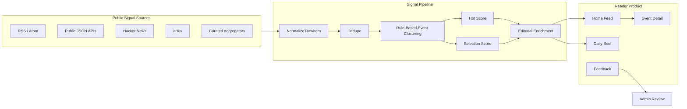
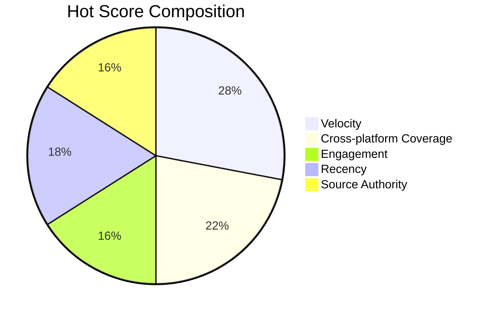
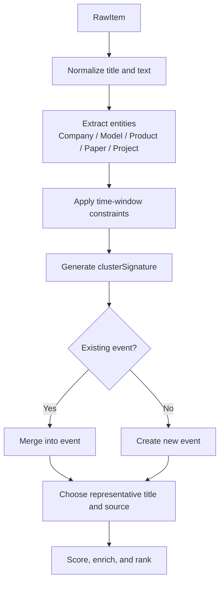
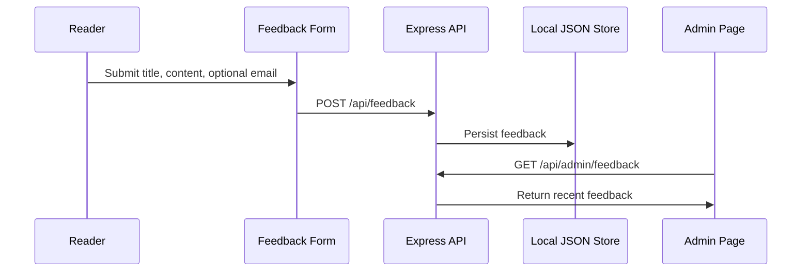

<p align="center">
  
</p>

<h1 align="center">Radar.Degotchi</h1>

<p align="center">
  <strong>An editorial intelligence radar for AI and technology signals.</strong>
  <br />
  From noisy raw feeds to clustered events, explainable scores, and newspaper-style daily briefs.
</p>

<p align="center">
  <strong>English</strong> · <a href="./README.zh-CN.md">中文</a>
</p>

<p align="center">
  
  
  
  
  
  
</p>

---

## What It Is

Radar.Degotchi is a local-first AI/technology signal intelligence product. It is designed for readers who do not want another infinite news list, yet still need a reliable way to understand what has changed in the last 24 hours.

The system collects public signals from official blogs, AI media, Hacker News, arXiv, RSS feeds, selected aggregators, and technical communities. It then normalizes raw items, clusters them into events, scores those events, and presents the result as a newspaper-inspired reading experience.

The core product philosophy is simple:

> **Read conclusions first. Inspect evidence second. Keep the scoring logic explainable.**

## Why It Exists

AI news is not scarce. The problem is that it is noisy, duplicated, partially translated, context-poor, and unevenly sourced. The same announcement can appear as a company blog post, a Hacker News thread, an X repost, an RSS item, and a media write-up. Treating each item as an independent article makes the reader do the clustering manually.

Radar.Degotchi treats news as **event intelligence** instead of feed entries.

| Layer | Description | Reader-Facing Surface |
| --- | --- | --- |
| `RawItem` | A single fetched item from RSS, API, HN, arXiv, media, or aggregator sources. | Evidence list inside event detail. |
| `Event` | A normalized cluster of related raw items, entities, and source metadata. | Main home feed card and detail drawer. |
| `Brief` | A daily editorial package generated from selected events. | Newspaper-style daily brief and shareable short path. |
| `Admin` | Operational surface for source health, event inspection, recompute, and feedback review. | Hidden management route. |

## System Shape



## Source Trust Model

Sources are intentionally not treated as equal. A single official release, a mainstream technical blog, a community post, and an aggregator summary carry different risk profiles.

Radar.Degotchi models each source with three dimensions:

| Dimension | Examples | Purpose |
| --- | --- | --- |
| Tier | `T1`, `T1.5`, `T2` | Officiality, editorial reliability, and noise risk. |
| Type | `official_blog`, `media`, `paper`, `community`, `aggregator`, `video` | Interprets the source's role in the information chain. |
| Weight | Usually around `0.88` to `1.25` | Fine-grained adjustment inside the same tier/type bucket. |

Source authority is calculated before an event is scored:

```text
SourceAuthority = clamp(TierWeight × TypeWeight × SourceWeight × 70)
```

This does not delete weaker signals. Instead, it makes them visible as lower-confidence evidence until they receive stronger corroboration.

## Event Scoring

Radar.Degotchi uses two complementary scores:

- **Hot Score**: Is the event currently gaining attention?
- **Selection Score**: Is the event worthy of the front page?

### Hot Score

```text
HotScore =
  VelocityScore       × w_velocity
+ CrossPlatformScore  × w_cross_platform
+ EngagementScore     × w_engagement
+ RecencyScore        × w_recency
+ SourceAuthority     × w_source_authority
```

| Factor | Meaning | Signal |
| --- | --- | --- |
| `VelocityScore` | How concentrated recent mentions are. | 6h mentions vs 24h mentions. |
| `CrossPlatformScore` | Whether the signal escaped one source silo. | Number of independent platforms. |
| `EngagementScore` | Whether communities are reacting. | Views, likes, HN points, comments. |
| `RecencyScore` | Whether the event is still fresh. | Time decay from `lastSeenAt`. |
| `SourceAuthority` | Whether attention comes from reliable sources. | Average authority of event sources. |



Hotness alone is not enough. A noisy single-source spike can rank lower than a quieter event backed by official or multi-source evidence.

### Selection Score

```text
SelectionScore =
  Importance    × w_importance
+ Novelty       × w_novelty
+ Actionability × w_actionability
+ Credibility   × w_credibility
+ AudienceFit   × w_audience_fit
+ CategoryBoost
+ TrustBoost
+ CrossPlatformBoost
```

| Factor | What It Measures |
| --- | --- |
| `Importance` | Impact on model capability, product ecosystems, infra, regulation, or company strategy. |
| `Novelty` | Whether the event contains new information rather than repeated coverage. |
| `Actionability` | Whether readers can make a product, research, tooling, or market decision from it. |
| `Credibility` | Whether strong sources support the event. |
| `AudienceFit` | Whether it belongs in an AI/technology radar rather than generic tech noise. |

Thresholds are tier-aware:

| Primary Tier | Selection Behavior |
| --- | --- |
| `T1` | Can enter the front page earlier because the primary source is official or highly authoritative. |
| `T1.5` | Requires a stronger combined quality score. |
| `T2` | Needs corroboration or remains in watch mode. |

## Event Clustering

The MVP deliberately avoids asking an LLM to decide event identity. Clustering remains deterministic, inspectable, and replaceable.



This preserves auditability:

- Every event can be traced back to raw items.
- Every detail drawer keeps source links and timeline evidence.
- Source tiers influence ranking and explanation.
- Admin review can later support merge, split, retitle, and manual correction.

## Reader Experience

The home feed is intentionally not a dashboard. It keeps the high-level card focused:

| Card Field | Purpose |
| --- | --- |
| Conclusion title | What happened. |
| Summary | The shortest readable synthesis. |
| Why it matters | Why a normal AI/tech reader should care. |
| Trust hint | High confidence, multi-source, community buzz, or watch state. |
| Original source | Direct path to the evidence. |

Full source context, timelines, raw snippets, and scoring explanations live inside the detail drawer.

## Feedback and Hidden Admin

Radar.Degotchi includes a lightweight feedback loop:



The admin surface is intentionally hidden from the public navigation. It remains available as an operational route for recompute, event inspection, source visibility, and feedback review.

## Design Language

Radar.Degotchi uses a newspaper-inspired interface: restrained ink, paper texture, editorial hierarchy, serif headlines, narrow metadata, and subtle micro-motion. The product should feel closer to an intelligence digest than a SaaS control panel.

Key design rules:

- Content first, metrics second.
- Evidence is always available but never forced into the first glance.
- Score explanations must be interpretable.
- Motion should support reading, not decorate the page.
- The admin layer should not leak into the reader experience.

## Technical Principles

| Principle | Implementation Implication |
| --- | --- |
| Local-first | Data ingestion, scoring, feedback, and brief generation can operate locally. |
| Explainable ranking | Scores expose their factor composition. |
| Source-aware trust | Tier/type/weight enter scoring before ranking. |
| Deterministic clustering | Rule-based event grouping keeps the MVP auditable. |
| LLM-optional enrichment | AI can improve summaries, but must not be the source of truth for clustering or evidence. |
| Reader-grade UI | The public surface optimizes for comprehension, not operator telemetry. |
