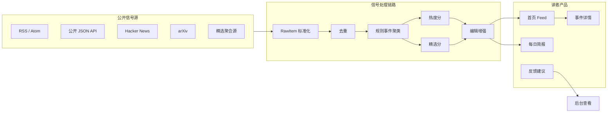
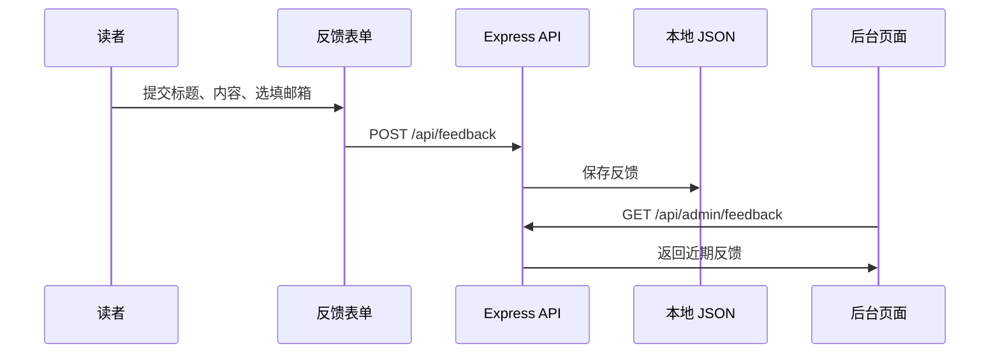

<p align="center">
  
</p>

<h1 align="center">Radar.Degotchi</h1>

<p align="center">
  <strong>一个面向 AI 与科技信号的编辑型情报雷达。</strong>
  <br />
  把嘈杂信源整理成事件聚类、可解释排序和报纸风格日报。
</p>

<p align="center">
  <a href="./README.md">English</a> · <strong>中文</strong>
</p>

<p align="center">
  
  
  
  
  
  
</p>

---

## 这是什么

Radar.Degotchi（逮奇雷达）是一套本地优先的 AI/科技信号情报产品。它不是普通资讯流，也不是后台大屏，而是帮助读者用更少时间理解过去 24 小时真正发生了什么。

系统会从官方博客、AI 媒体、Hacker News、arXiv、RSS、公开 API、聚合站和技术社区抓取公开信号，然后完成标准化、去重、事件聚类、评分和编辑化展示。

产品原则很直接：

> **先读结论，再看证据；排序要能解释，信源要能追溯。**

## 为什么需要它

AI 新闻并不稀缺，真正的问题是噪音、重复、二手转述和上下文不足。同一个发布可能同时出现在公司博客、Hacker News、媒体报道、X 转述和聚合摘要里。如果把每一条都当成独立新闻，读者就只能自己手动聚类。

Radar.Degotchi 把新闻看成 **事件级情报**，而不是一条条孤立链接。

| 层级 | 说明 | 用户看到什么 |
| --- | --- | --- |
| `RawItem` | 从 RSS、API、HN、arXiv、媒体或聚合源抓到的一条原始内容。 | 详情里的证据列表。 |
| `Event` | 由相关原始内容、实体、时间和信源信息归并出的事件。 | 首页 Feed 卡片和详情抽屉。 |
| `Brief` | 从精选事件生成的日报包。 | 报纸风格今日简报和可分享短路径。 |
| `Admin` | 信源健康、事件检查、重新计算和反馈查看。 | 隐蔽管理入口。 |

## 系统形态



## 信源可信模型

信源不是平等的。官方发布、主流技术媒体、社区热帖和聚合摘要在可信度与噪音风险上完全不同。

Radar.Degotchi 用三个维度描述信源：

| 维度 | 示例 | 作用 |
| --- | --- | --- |
| 等级 | `T1`, `T1.5`, `T2` | 体现官方性、编辑可靠性和噪音风险。 |
| 类型 | `official_blog`, `media`, `paper`, `community`, `aggregator`, `video` | 判断这个信源在信息链条里的角色。 |
| 权重 | 通常在 `0.88` 到 `1.25` 左右 | 在同等级和同类型内部做细微调整。 |

信源权威度会先于事件评分计算：

```text
SourceAuthority = clamp(TierWeight × TypeWeight × SourceWeight × 70)
```

这不会删除弱信号，而是让它们以较低置信度进入证据链，直到得到更强信源印证。

## 事件评分

Radar.Degotchi 使用两类分数：

- **热度分**：事件是否正在获得关注。
- **精选分**：事件是否值得进入首页和日报。

评分不会作为首页的主要文案堆给普通读者，而是在详情中以“为什么上榜”解释。

## 首页体验

首页不是后台驾驶舱。卡片只保留高价值阅读信息：

| 卡片字段 | 作用 |
| --- | --- |
| 结论标题 | 发生了什么。 |
| 摘要 | 最短可读综合。 |
| 为什么重要 | 普通 AI/科技读者为什么应该关心。 |
| 可信提示 | 高可信、多源验证、社区热议或待观察。 |
| 原始来源 | 直接跳转到证据页面。 |

完整来源、时间线、原始摘录和评分解释放在详情抽屉里。

## 反馈与隐蔽后台

产品包含一个轻量反馈闭环：



后台入口不会出现在普通导航中，只作为运营维护路由存在。

## 设计语言

Radar.Degotchi 采用报纸启发的界面语言：克制的墨色、纸张纹理、编辑层级、衬线标题、窄元信息和轻微动效。它应该更像一份情报摘要，而不是 SaaS 控制台。

关键规则：

- 内容优先，指标其次。
- 证据永远可追溯，但不强塞进第一眼。
- 评分解释必须可读。
- 动效服务阅读，而不是装饰。
- 后台能力不能污染普通用户首页。

## 技术原则

| 原则 | 实现含义 |
| --- | --- |
| 本地优先 | 抓取、评分、反馈和日报生成都可以在本地运行。 |
| 可解释排序 | 分数需要暴露因子构成。 |
| 信源感知 | 等级、类型和权重先进入评分，再影响排序。 |
| 确定性聚类 | MVP 用规则聚类，便于审计和纠偏。 |
| LLM 可选增强 | AI 可以改善摘要，但不能决定聚类和证据真伪。 |
| 读者级界面 | 公开页面优先服务理解，不展示运营遥测。 |
